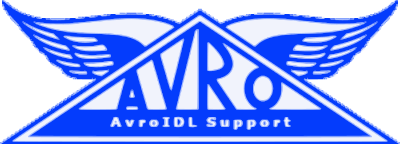

IntelliJ plugin for Apache Avro™ Schema Support
===============================================

This plugin extends IntelliJ, PyCharm and other JetBrains IDEs to more easily work with Avro&trade; schemata and
protocols in both IDL format (<code>.avdl</code>) or JSON format (<code>.avsc</code> and <code>.avpr</code>).

Aside from file types, it features more comprehensive JSON schemata for the JSON formats than
the [JSON SchemaStore](https://www.schemastore.org/).

IDL features include:

* Syntax & error highlighting
* Code completion
* Formatting (configurable)
* Inspections and quick fixes
* Navigation, renaming, quote/brace pairs, etc.
* Converting Avro schemas/protocols from/to IDL

Write a review
--------------

Writing a review in JetBrains Marketplace is very valuable. Reviews:

* provide feedback and motivation for the authors
* help other users to find out what plugins work, and what don't

**If you like what you see:**

Please go to the [Avro Schema Support](https://plugins.jetbrains.com/plugin/15728-apache-avro-schema-support) plugin
page in the JetBrains Marketplace. Log in with your JetBrains account and write a review.

**If you find that something is not working as you expect it to work:**

Please don't file bug reports as a review. GitHub is the place where you can find
[support for fixing bugs and making improvements](https://github.com/opwvhk/avro-schema-support/issues), as well as a
[discussion forum to ask questions](https://github.com/opwvhk/avro-schema-support/discussions).

Trademarks, Logo's, etc.
------------------------

The pigeon logo was created by **Emma K** ([emmak3l :octocat:](https://github.com/emmak3l)),
and is used for this plugin with permission.

The names Apache Avro, Avro™, Apache®, and the Apache Avro paper plane logo are either registered trademarks or
trademarks of The Apache Software Foundation. They are used in the project to signal intended compatibility, and are not
intended to suggest endorsement.
